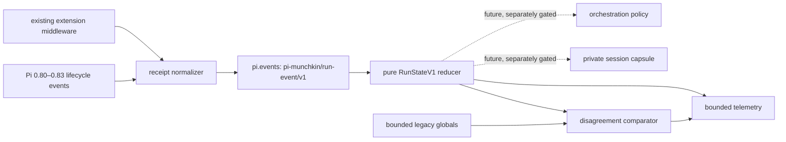

# Run Kernel PR 1: shadow architecture

Status: source review only. No live mirror, gate round, persistence, enforcement, or model-visible
default adoption is authorized by this document.

## Why a kernel instead of another prompt

The harness already has capable mechanisms—plan execution, verification ordering, failure
episodes, dynamic tool activation, compaction, research, and subagents—but their state is split
between extension-local variables, redacted globals, persisted plan files, and Pi lifecycle
events. Small models should not have to reconstruct that control plane from prose. The first
upgrade therefore creates one typed observation layer beneath those mechanisms before any new
memory or orchestration is attempted.

PR 1 is intentionally a **shadow reducer**. Existing extensions remain the behavioral authority.
The kernel observes their finalized outcomes, compares its derived view with their bounded legacy
signals, and measures disagreements. It cannot send a message, register a tool or command, change
the active tool set, block a call, abort a run, or write a capsule.

## Event and state topology

The extension is last in the package manifest. `tool_result` therefore sees finalized middleware
state before `tool_execution_end` seals one receipt. The receipt normalizer deduplicates by raw
call ID in bounded process memory, but exposes only its SHA-256 digest. Validation failures and
policy rejections that lack a normal result remain observable through execution-end receipts.

The shared event channel is versioned and closed: unknown `run/*` strings are rejected instead of
being accepted as partially compatible state transitions. Every event has a monotonic sequence
and time. The reducer ignores replayed/out-of-order sequences.

## Two clocks, not one overloaded status

Operational lifecycle and semantic work state answer different questions:

| Dimension | Values | Question |
|---|---|---|
| lifecycle | `starting`, `active`, `settling`, `idle`, `shutdown` | Is Pi currently running or settled? |
| phase | `intake`, `local_recon`, `external_research`, `preflight`, `planning`, `execution`, `verification`, `recovery`, `blocked`, `complete` | What kind of work is the run doing? |
| outcome | `active`, `complete`, `blocked`, `paused`, `unverified` | What is safe to conclude at the current boundary? |

`agent_settled` changes lifecycle to `idle`; it does **not** imply semantic completion. A run with
a successful mutation but no later valid gate settles as `unverified`. A structured plan with
open items settles as `paused`. A read-only response can complete, and a structured run completes
only after its exported open-item count reaches zero and its mutation/verification contract is
satisfied.

## Execution-order truth

Each source mutation and verifier records start and end sequence numbers. Verification is valid
only when the successful verifier **started after** the latest successful source mutation ended.
This rejects concurrent/overlapping gates and invalidates a green result when a later mutation
succeeds. The project-gate detector is shared with `verify-gate`; the kernel does not maintain a
second classifier.

## Identity and recovery boundaries

- A session hash identifies one Pi session replacement boundary.
- A run hash identifies one semantic objective across retries and compactions.
- A cycle hash identifies one agent-loop execution.
- A tool-call hash identifies one canonical receipt.
- `before_agent_start` hashes the normalized objective; the expanded prompt is immediately
  discarded. A new objective after semantic completion creates a new run.
- Retry and compaction cycles retain the run ID. Compaction increments a generation counter and
  enters `recovery`; it does not pretend the objective changed.

This is deliberately not a durable memory design yet. The typed reducer is the schema seam a
future private capsule can consume after retention, migration, trust-framing, and resume semantics
are separately reviewed.

## Privacy invariant

`RunStateV1`, shared events, and telemetry may contain only:

- fixed enums and booleans;
- bounded safe tool/family labels;
- counts, byte lengths, sequences, and timestamps;
- SHA-256 hashes of targets, plan items, objectives, IDs, gates, and the harness surface;
- a fixed failure class.

They may not contain prompts, arguments, commands, output, errors, URLs, endpoints, credentials,
or paths. A defense-in-depth snapshot validator rejects forbidden field names, absolute private
paths, unbounded arrays/strings, and malformed hashes before a later persistence PR can reuse the
state.

## Rollback and measurement

`RUN_KERNEL=off` registers no handlers and no event-bus subscription. `shadow` is the default and
is counterfactually pinned to leave Pi messages, entries, tools, commands, active-tool selection,
and control flow unchanged. Telemetry proves observation and disagreement exposure only; it makes
no efficacy claim. Measurements from the new source surface must not be pooled with an earlier
surface hash even though the kernel is model-invisible.

## Explicitly deferred

The following remain later, independently reviewable decisions:

- a private per-run capsule (Markdown view over structured state, never Markdown as authority);
- role/subagent routing and local-versus-web research policy;
- preflight/environment preparation transitions;
- plan-artifact ownership and historical capsule records;
- policy that consumes the state machine to steer, activate, pause, or resume;
- live mirroring, calibration, and adoption.

The rule for those PRs is simple: reducers own facts, policy owns decisions, renderers own model
and human views, and persistence owns recovery. No one layer gets to quietly do all four.
